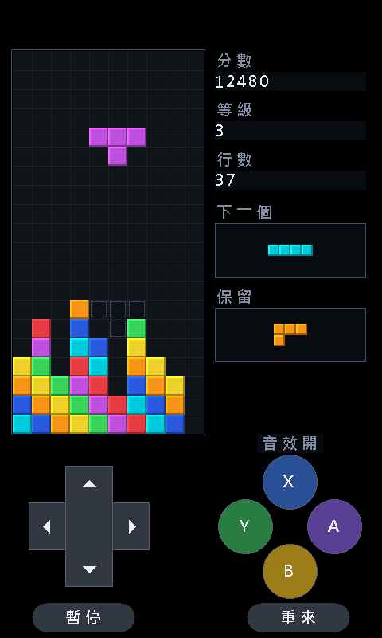

# STM32H7S78-DK 俄羅斯方塊

在 STM32H7S78-DK 開發板上跑的直立版俄羅斯方塊，全繁體中文介面，
超任風格的觸控虛擬手把。



## 特色

- **直立畫面** — 面板是 800×480 橫向，繪圖層自己做 90 度旋轉成 480×800
- **繁體中文介面** — 自製點陣字型，74 個字只佔 5.2 KB
- **超任風格手把** — 十字方向鍵 + A/B/X/Y 圓鈕，觸控操作
- **完整遊戲規則** — SRS 旋轉含踢牆、7-bag 隨機、幽靈落點、保留、20 級重力
- **測試涵蓋** — 385,000 項檢查在 QEMU 上執行，不需要板子

## 操作

| 控制 | 功能 |
|---|---|
| 十字鍵 ◀ ▶ | 左右移動（長按連續） |
| 十字鍵 ▼ | 軟降 |
| 十字鍵 ▲ | 硬降（直接落底） |
| Ⓐ | 順時針旋轉 |
| Ⓑ | 逆時針旋轉 |
| Ⓨ | 保留 / 交換 |
| 暫停 | 暫停與繼續 |
| 重來 | 重新開始 |

## 硬體需求

- STM32H7S78-DK 開發板
- USB-C 資料線（**不是充電線**，純充電線會讓板子完全無法辨識）
- SW1（BOOT0 滑動開關）置於 0

## 環境需求

- [STM32CubeIDE](https://www.st.com/en/development-tools/stm32cubeide.html)
  （需免費 ST 帳號；內含 arm-none-eabi-gcc、CubeProgrammer、external loader）
- Python 3 + Pillow（產生字型用）
- QEMU（選用，跑測試用）：`winget install SoftwareFreedomConservancy.QEMU`

## 直接玩（不想自己編譯）

`firmware/` 底下有預編譯好的燒錄檔，接上板子燒進去就能玩：

```bash
CLI="STM32_Programmer_CLI"
EL=".../ExternalLoader/MX66UW1G45G_STM32H7S78-DK.stldr"

"$CLI" -c port=SWD mode=UR -w firmware/boot_xip.hex -v              # 只需第一次
"$CLI" -c port=SWD mode=UR -el "$EL" -w firmware/tetris_appli.hex -v
"$CLI" -c port=SWD mode=HOTPLUG -rst
```

詳細說明見 [firmware/README.md](firmware/README.md)。

## 建置與燒錄

```bash
# 1. 取得 ST 韌體包並建立專案（只需執行一次，約下載 540 MB）
./scripts/setup.sh

# 2. 編譯
./scripts/build.sh

# 3. 燒錄（第一次要加 --boot 一併燒 bootloader）
./scripts/flash.sh --boot

# 之後只更新遊戲
./scripts/flash.sh
```

如果 CubeIDE 裝在別的路徑，改一下 `scripts/` 裡的 `IDE` 與 `CLI` 變數。

## 測試

```bash
./scripts/test.sh
```

在 QEMU 的 Cortex-M7 機型上執行，涵蓋遊戲邏輯、直立座標旋轉、
字型資料、觸控映射。

也可以把畫面渲染成 PNG 檢查版面，不需要板子：

```bash
cd shots && python ../tools/raw2png.py
```

## 專案結構

```
core/          遊戲本體（與硬體無關，可移植）
  tetris.c       遊戲邏輯：方塊、旋轉、消行、計分
  gfx.c          繪圖層：直立旋轉、文字、圖形
  ui.c           畫面版面與手把繪製
  input.c        觸控轉換與按鍵重複
  font_zh.c      產生的中文點陣字型
app_src/       韌體整合層（LTDC、DMA2D、觸控初始化）
test/          QEMU 測試
tools/         字型產生、專案設定、畫面轉檔
scripts/       建置、燒錄、測試、匯出腳本
firmware/      預編譯燒錄檔
docs/          開發筆記
```

## 開發筆記

**[docs/stm32h7s78-notes.md](docs/stm32h7s78-notes.md)** 記錄了這塊板子上
踩過的所有坑與正確做法，包括：

- 為什麼 `BSP_LCD_SetLayerAddress` 會造成畫面閃爍，該怎麼改
- `BSP_LCD_Init` 預設是 ARGB8888 不是 RGB565 的陷阱
- PSRAM 的 MPU 設定
- DMA2D 的快取一致性陷阱，以及把偶發錯誤變成可量測的診斷方法
- 效能實測數據與量測方法
- 資源用量（決定能塞多少款遊戲）

**之後要在這塊板子上開發別的專案，建議先讀這份。**

## 已知限制

- 無音效。板載 WM8904 codec 只有耳機輸出，沒有內建喇叭。
- 需要旋轉縮放的遊戲應改用這顆的 GPU2D（NeoChrom），DMA2D 只能做矩形搬運與混色。

## 授權

遊戲程式碼採 MIT 授權。

ST 的韌體包（`cube/`）與 BSP 有自己的授權條款，不包含在本倉庫內，
由 `scripts/setup.sh` 從 ST 官方倉庫取得。
